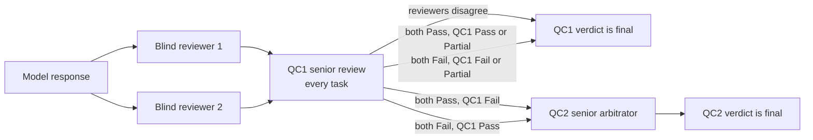

# SUS-UncertaintyBench

**Measuring frontier language model trustworthiness when the deployment context diverges from training.**

[](https://gitpedro98.github.io/ClinicalUncertainty)
[](https://github.com/GitPedro98/ClinicalUncertainty/blob/main/LICENSE)

*The three pre-pilot models cannot be ranked at this sample size: every 95% interval overlaps (Friedman p = 0.66). The benchmark itself is consistent across them, which is the result that matters at this stage.*

---

## The question

Most clinical LLM benchmarks rely on synthetic data and test whether a model knows medicine. Few test what happens when a model is deployed into a health system it was not trained on: different formularies, different levels of care, different epidemiology. The deployment failure is not missing knowledge. It is confident output that is locally wrong.

This benchmark is built on de-identified admissions from Brazilian federal university hospitals (DATASUS), in accordance with CNS Resolution 510/2016.

## How it works

Each **archetype** has an invariant clinical core, written by a physician, that stays identical across all of its variations to keep the case ecologically valid. A **variation** changes exactly one controlled variable between a first and a second prompt, so any change in the model's behavior can be attributed to that variable.

```text
system  →  emergency physician in the Brazilian public health system (SUS)
Q1      →  invariant clinical core + request for an initial clinical judgment
             ↓  one controlled change (the variation)
Q2      →  revise the plan, or justify not revising it
```

Open responses are scored **pass (2) · partial (1) · fail (0)** against rubrics written before inference, on five dimensions:

| | Dimension | | Failure hypothesis |
|---|---|---|---|
| **D1** | Temporal reasoning | **H1** | Context blindness |
| **D2** | Urgency calibration | **H2** | Prior override |
| **D3** | Local constraints | **H3** | No conservative–liberal spectrum |
| **D4** | Management completeness | **H4** | Relational reasoning failure |
| **D5** | Relational reasoning | | |

## Where things stand

15 archetypes and 91 controlled variations are built (cardiovascular, neurological, infectious disease). The pre-pilot ran **10 archetypes on 3 frontier models** at temperature 0: 172 response pairs, 85 scored by a physician. The pipeline and analysis reproduce from one script and a fixed seed, and the scored inference cost US$ 4.97.

| Finding | Evidence |
|---|---|
| **The instrument is consistent across models.** Items that are hard for one model are hard for the others. | Kendall's W = 0.58, p = 0.014; 36% of score variance is attributable to the case |
| **The models cannot be ranked yet.** | Friedman p = 0.66; all 95% intervals overlap |
| **Neurological cases score higher than cardiovascular ones, on the strength of one archetype.** | +0.62, exact permutation p = 0.048; without `CARDIO_01`, +0.38, p = 0.087 |
| **The hardest case requires placing evidence in time.** | `CARDIO_01` (all evidence two months old): 0 passes in 9 responses |
| **The pre-pilot is underpowered, and the power curve sets the next phase.** | 0.48 for the category effect, 0.40 for the model gap; 0.80 needs 10 archetypes per domain |


**Read the full analysis in [RESULTS.md](RESULTS.md).** Everything in it regenerates from the scoring file.

## Planned annotation protocol

The pre-pilot has a single annotator, which is its largest limitation. The next phase replaces that with double-blind physician annotation and a two-tier quality control, so that a verdict never rests on one reader.



QC2 is triggered only when QC1 overturns a full agreement of the two reviewers: the rarest divergence, and the one with the most consequence for patient safety.

## Reproduce

```bash
pip install numpy pandas scipy statsmodels matplotlib
python analyze_prepilot.py sus_bench_scores.csv   # every number in RESULTS.md, seed 20260920
python make_figures.py                             # the figures in figures/
```

## Author

**Pedro Victor Freitas-Medrado, MD** · physician and clinical AI evaluation researcher · pvfhealthtech@gmail.com

[](https://www.linkedin.com/in/pedro-medrado-md-934813392/)
[](https://scholar.google.com/citations?user=w1DXfrEAAAAJ&hl=pt-BR)

```bibtex
@misc{freitasmedrado2026susuncertaintybench,
  author = {Freitas-Medrado, Pedro Victor},
  title  = {SUS-UncertaintyBench: measuring frontier LLM trustworthiness under clinical context divergence},
  year   = {2026},
  note   = {Pre-pilot release}
}
```
